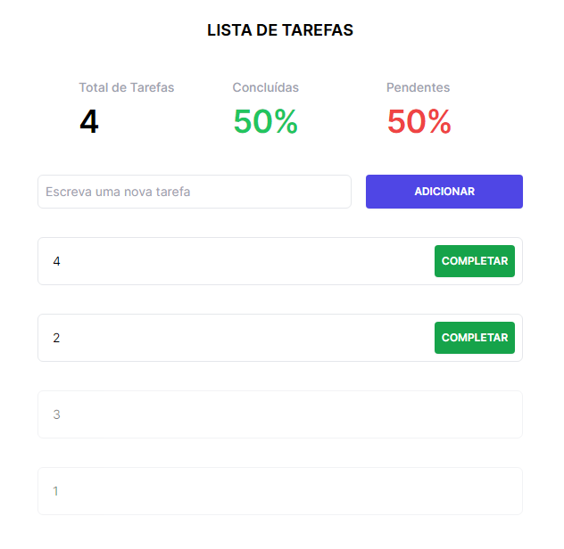

### Live App: https://todo-list-react-challenge-phi.vercel.app/

# Desafio -> Lista de Tarefas em React

O objetivo deste desafio é criar uma lista de tarefas com armazenamento persistente de dados. A lista de tarefas deve ser estilizada com [Tailwind CSS](https://tailwindcss.com/) e, também, suportar a adição/conclusão de tarefas.

*O desafio deve ser executado em até 1h15m*. Você deve gerenciar o seu tempo e priorizar as tarefas de acordo com a sua experiência e conhecimento.

## O que será avaliado?

1. Respeito aos requisitos e as limitações de desenvolvimento;
2. Conhecimento de padrões e boas práticas de programação;
3. Utilização de recursos do React, TypeScript e Tailwind CSS;
4. Gerenciamento de tempo e priorização de tarefas;
5. Ser consistente e saber argumentar escolhas.

## Requisitos Funcionais

1. O usuário deve ser capaz de adicionar tarefas a uma lista;
   * As tarefas sempre adicionadas no início da fila;
2. O usuário deve ser capaz de marcar tarefas adicionadas como concluídas;
   * As tarefas sempre finalizadas no final da fila;
3. Quando passar 30 segundos após a conclusão de uma tarefa, ela deve ser oculta da lista, mas permanecer no armazenamento;
4. O usuário deve visualizar em um cabeçalho a quantidade de tarefas adicionadas, concluídas (em porcentagem) e pendentes (em porcentagem);
   * Para as tarefas pendentes, se a porcentagem for `>= 50%` deve ser exibida em **vermelho**, caso contrário, em **verde**;
   * Para as tarefas concluídas, se a porcentagem for `>= 50%` deve ser exibida em **verde**, caso contrário, em **vermelho**.
5. O usuário deve conseguir rever as suas tarefas novamente, mesmo que feche o navegador ou atualize a página;
6. O usuário deve conseguir migrar do modo claro para o modo escuro e vice-versa.

## Requisitos Não Funcionais

1. Utilizar `useEffect`, `useState`, `useCallback` e `useMemo` no projeto;
2. Seguir o padrão de projeto com ESLint, Prettier e organizar os recursos do projeto em pastas dentro de `/src/core`;
3. Utilizar Redux ou Contexto para gerenciar o estado da aplicação *- com TypeScript*;
4. As definições de tipos *- com TypeScript -* devem ser aplicadas em todos os componentes, funções e hooks;
5. Reproduzir a interface de usuário em exemplo.

## Limitações de Desenvolvimento

1. É permitido consulta somente às documentações oficiais do [React](https://react.dev/), [Redux](https://redux.js.org/), [NextJS](https://nextjs.org/), [TypeScript](https://www.typescriptlang.org/) e [Tailwind CSS](https://tailwindcss.com/);
2. Não é permitido consultar a documentação do JavaScript;
3. Não é permitido o uso de ferramentas de inteligência artificial (como Chat GPT ou Github Copilot) e nem consultas no Google, fóruns ou similares;
4. Os arquivos de configuração não devem ser alterados, se necessário utilize o arquivo `.vscode/settings.json` para alinhar as configurações do seu VSCode com as configurações do projeto (ESLint, Prettier, etc);
5. Não é permitido adicionar nenhuma dependência ao projeto, somente as que já estão instaladas.

## Ao finalizar o desafio

Com base nos requisitos implementados, será solicitado:

1. Adicionar as tarefas (em ordem): 1, 2, 3, 4;
2. Concluir as tarefas (em ordem): 3, 1;
3. Esperar por 30 segundos;
4. Pressionar F5;
5. Trocar o tema para o modo escuro.
